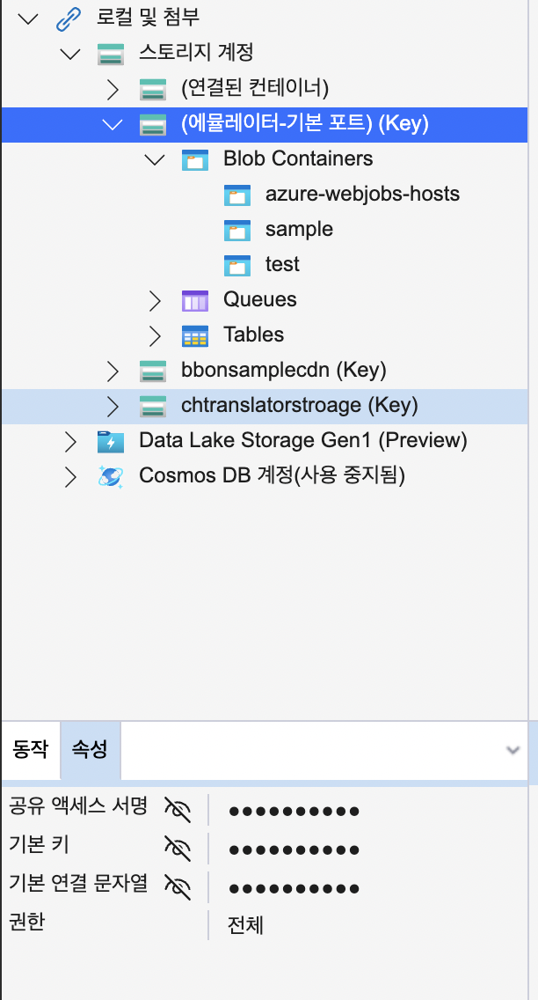

## Azurite

Azurite 에뮬레이터는 Azure Blob, Queue Storage 및 Table Storage 애플리케이션을 테스트할 수 있는 무료 로컬 환경을 제공합니다. 


## Azurite 시작

[로컬 Azure Storage 개발에 Azurite 에뮬레이터 사용](https://docs.microsoft.com/ko-kr/azure/storage/common/storage-use-azurite?tabs=npm) 페이지를 참조하세요.

### 설치

npm 패키지를 전역위치에 설치합니다.

```bash
$ npm i -g azurite
```
### 시작

```bash
# Azurite 실행시 파일을 관리할 디렉터리를 작성합니다. (없는 경우)
$ mkdir ~/.azuite 
# Azurite 에뮬레이터를 실행합니다.
$ azurite --silent --location ~/.azurite --debug ~/.azurite/debug.log
# 출력
Azurite Blob service is starting at http://127.0.0.1:10000
Azurite Blob service is successfully listening at http://127.0.0.1:10000
Azurite Queue service is starting at http://127.0.0.1:10001
Azurite Queue service is successfully listening at http://127.0.0.1:10001
Azurite Table service is starting at http://127.0.0.1:10002
Azurite Table service is successfully listening at http://127.0.0.1:10002
```

> Azurite 에뮬레이터를 실행한 터미널 세션은 열어두셔야 합니다.
> 
> 종료하려면 <kbd>Control/Ctrl</kbd> + <kbd>c</kbd> 를 입력합니다.

## 확인

### Azure Storage Explorer 도구

[Azure Storage Explorer 도구](https://azure.microsoft.com/en-us/features/storage-explorer/)를 다운로드해서 설치 후 실행합니다.

탐색기 영역에서 `로컬 및 첨부 > 에뮬레이터 기본포트` 항목을 선택하면 로컬에서 실행중인 Azurite 에뮬레이터에 연결이 가능합니다.

연결된 후 연결문자열도 얻을 수 있습니다.




### 컨테이너 추가 및 파일 관리

탐색기 영역에서 `로컬 및 첨부 > 에뮬레이터 기본포트 < Blob Containers` 항목을 선택하고, 컨테이너를 추가합니다.

탐색기 영역에서 추가한 컨테이너를 선택한 후 오른쪽 파일 목록에 파일을 드래그 앤 드롭 또는 업로드 메뉴로 파일을 Azurite 에뮬레이터에 업로드할 수 있습니다.

이 때, 로컬 함수앱이 실행 중이고, 현재 컨테이너가 이미지 최적화 컨테이너로 지정된 경우 함수앱이 트리거됩니다.
